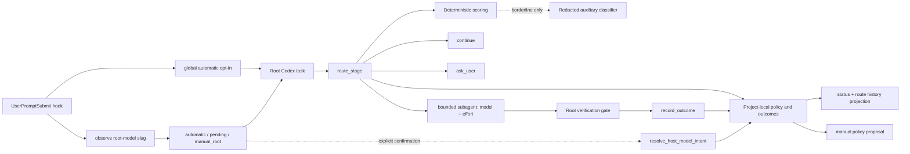

# Architecture

Adaptive Model Router is a Codex plugin, not a model proxy. The root task invokes a local MCP tool at a stage boundary and remains responsible for orchestration.

The public tool contracts are documented in [Tool reference](TOOLS.md). The MCP
server is the installed interface; `scripts/codex-route.mjs` is a source-tree
operations and diagnostics CLI, not a global command.

## Components

- `skills/adaptive-model-router/` describes the stage-boundary orchestration contract.
- `scripts/node-launcher.mjs` starts under the Node executable resolved by Codex, discovers a qualifying Node 24.15+ runtime when necessary, and preserves stdio, arguments, environment, and exit status across the handoff.
- `scripts/mcp-server.mjs` exposes strict, closed JSON schemas and emits only JSON-RPC on stdout.
- `scripts/lib/router.mjs` applies deterministic scoring, override priority, catalog capability checks, and monotonic escalation.
- `scripts/lib/app-server.mjs` owns one short-lived classifier app-server process with a single total deadline and early-notification buffering.
- `scripts/lib/database.mjs` owns SQLite migrations, short `BEGIN IMMEDIATE` transactions, exactly-once claims, and project/context isolation.
- `scripts/hook.mjs` handles exact control prefixes, the global automatic
  opt-in, root-model observation, fixed model-visible context, visible
  status/history reports, and the two-pass Stop outcome reminder.
- `scripts/lib/presentation.mjs` formats user-visible reports while preserving
  the root-model versus bounded-target boundary.
- `hooks/hooks.json` supplies separate POSIX and `commandWindows` launch commands.
  Both resolve through the installed plugin root and the runtime launcher, so
  hook execution does not depend on a POSIX shell on Windows.

## Route lifecycle

1. Derive a project HMAC from the Git common directory, submodule common directory, or canonical non-Git working directory. Derive a second context HMAC from the task identifier.
2. When the global opt-in is enabled, the prompt hook observes the host-provided
   active model slug. The first valid value establishes a baseline. A later
   change creates one pending intent event for the task; no value or an invalid
   value remains host-managed and does not imply manual intent.
3. If the task is pending confirmation or `manual_root`, return `continue` with
   no bounded target. Resolving `keep_automatic` affects the next stage;
   resolving `manual_root` lasts only for the current task/context.
4. Resolve overrides in this order: request, once, session, project, optional global.
5. Continue immediately for trivial/no-output work unless an override explicitly requests delegation.
6. Load the root-visible catalog only for observation and conservative
   compatibility. Build the bounded delegate catalog from the current
   `hostCapabilities.delegation`; when absent, permit only known Sol/Terra
   entries from the visible catalog. Never infer Luna delegation from root
   visibility.
7. Score locally. Only substantive borderline stages may call the auxiliary
   classifier. Its independent ephemeral app-server calls `model/list` and
   chooses Luna, then Terra, then Sol from that classifier-only catalog.
8. Apply risk floors and any monotonic failure escalation.
9. Insert the route. A once override is claimed and deleted in the same transaction as a real `delegate` insert. The row snapshots the currently observed root-model slug separately from the bounded target.
10. For a `delegate` route, the root performs the verification gate and records
   exactly one outcome. `continue` and `ask_user` routes do not have outcomes.

The route stores the model target and decision metadata, not the prompt or
evidence payload. On retry, callers provide only `previousRouteId` and factual
failure evidence; they cannot submit a forged previous route object.

`get_route_status` and `get_route_history` are read-only projections over the
same route/outcome rows. Consecutive delegated targets are compared at read
time to classify an initial, unchanged, or changed target. No second log is
maintained, so visible history cannot drift from learning/outcome state. The
projection explicitly reports the hook-observed root model when available,
that reasoning effort remains host-only, and that the router did not change the
root model. The Codex model selector therefore continues to describe the root
task, never the bounded-stage target.

SQLite `user_version` 2 adds task root-model state, model-change events, and the
root snapshot on each route while preserving version 1 routes, outcomes,
policy revisions, proposals, and learning cursors.

## Concurrency

The database uses WAL, `synchronous=NORMAL`, foreign keys, `trusted_schema=OFF`, a busy timeout, and bounded retry around short `BEGIN IMMEDIATE` transactions. No classifier, model discovery, file traversal, or other external work occurs inside a write transaction.

Uniqueness constraints protect route outcomes, pending proposals, and the one
effective pending host-model event per project/context. Concurrent hook
processes observing the same change converge on that event. Identical duplicate
outcomes and identical intent resolutions are idempotent; conflicting
duplicates fail. Approval checks the proposal's base revision in the same
transaction that creates its immutable child revision.

## Failure behavior

- Missing catalog or unavailable host delegation: continue with the current root model.
- A preferred automatic family missing from the delegate catalog falls forward
  to the next capable family; explicit unavailable targets ask the user.
- A host tooling rejection excludes the failed automatic target for one retry.
  Explicit routes never substitute, and a second automatic rejection continues
  in the root.
- Pending host-model intent or current-task manual mode: continue with the root
  model and never create a bounded subagent.
- Explicit unavailable target: ask the user; never silently substitute.
- Classifier failure: deterministic local route, followed by a three-failure/ten-minute circuit breaker.
- Storage failure during routing or hooks: sanitized fail-open behavior; outcome writes report an error because silently losing a final outcome would be misleading.
- Two completed automatic reasoning escalations: ask the user on the following failure.
- Node below 24.15: the launcher probes bounded standard runtime locations and either re-executes with a qualifying Node or exits with one generic error; router code never runs on the older runtime.

For operational symptoms and recovery steps, see
[Troubleshooting](TROUBLESHOOTING.md).
