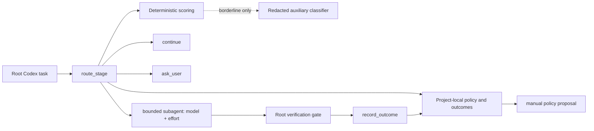

# Architecture

Adaptive Model Router is a Codex plugin, not a model proxy. The root task invokes a local MCP tool at a stage boundary and remains responsible for orchestration.

## Components

- `skills/adaptive-model-router/` describes the stage-boundary orchestration contract.
- `scripts/mcp-server.mjs` exposes strict, closed JSON schemas and emits only JSON-RPC on stdout.
- `scripts/lib/router.mjs` applies deterministic scoring, override priority, catalog capability checks, and monotonic escalation.
- `scripts/lib/app-server.mjs` owns one short-lived classifier app-server process with a single total deadline and early-notification buffering.
- `scripts/lib/database.mjs` owns SQLite migrations, short `BEGIN IMMEDIATE` transactions, exactly-once claims, and project/context isolation.
- `scripts/hook.mjs` handles exact control prefixes and the two-pass Stop outcome reminder.

## Route lifecycle

1. Derive a project HMAC from the Git common directory, submodule common directory, or canonical non-Git working directory. Derive a second context HMAC from the task identifier.
2. Resolve overrides in this order: request, once, session, project, optional global.
3. Continue immediately for trivial/no-output work unless an override explicitly requests delegation.
4. Load visible known models, sorted by numeric priority, and check reasoning-effort capabilities.
5. Score locally. Only substantive borderline stages may call the auxiliary classifier.
6. Apply risk floors and any monotonic failure escalation.
7. Insert the route. A once override is claimed and deleted in the same transaction as a real `delegate` insert.
8. The root performs the verification gate and records exactly one outcome.

## Concurrency

The database uses WAL, `synchronous=NORMAL`, foreign keys, `trusted_schema=OFF`, a busy timeout, and bounded retry around short `BEGIN IMMEDIATE` transactions. No classifier, model discovery, file traversal, or other external work occurs inside a write transaction.

Uniqueness constraints protect route outcomes and pending proposals. Identical duplicate outcomes are idempotent; conflicting duplicates fail. Approval checks the proposal's base revision in the same transaction that creates its immutable child revision.

## Failure behavior

- Missing catalog or unavailable host delegation: continue with the current root model.
- Explicit unavailable target: ask the user; never silently substitute.
- Classifier failure: deterministic local route, followed by a three-failure/ten-minute circuit breaker.
- Storage failure during routing or hooks: sanitized fail-open behavior; outcome writes report an error because silently losing a final outcome would be misleading.
- Two completed automatic reasoning escalations: ask the user on the following failure.
