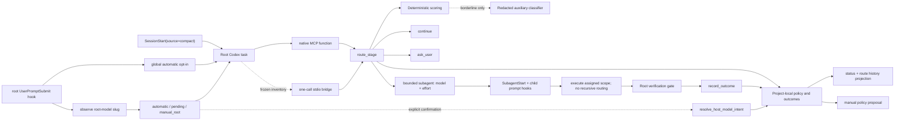

# Architecture

Adaptive Model Router is a Codex plugin, not a model proxy. The root task invokes a local MCP tool at a stage boundary and remains responsible for orchestration.

The public tool contracts are documented in [Tool reference](TOOLS.md). The MCP
server is the installed interface; `scripts/codex-route.mjs` is a source-tree
operations and diagnostics CLI, not a global command.

```mermaid
flowchart LR
    Prompt["root UserPromptSubmit hook"] --> OptIn["global automatic opt-in"]
    Prompt --> Observe["observe root-model slug"]
    Compact["SessionStart(source=compact)"] --> Root
    Observe --> Intent["automatic / pending / manual_root"]
    OptIn --> Root["Root Codex task"]
    Intent --> Root
    Root --> Native["native MCP function"]
    Root -. "frozen inventory" .-> Bridge["one-call stdio bridge"]
    Native --> Route["route_stage"]
    Bridge --> Route
    Route --> Deterministic["Deterministic scoring"]
    Deterministic -. "borderline only" .-> Classifier["Redacted auxiliary classifier"]
    Route --> SQLite["Project-local policy and outcomes"]
    Route --> Continue["continue"]
    Route --> Ask["ask_user"]
    Route --> Delegate["bounded subagent: model + effort"]
    Delegate --> SubStart["SubagentStart + child prompt hooks"]
    SubStart --> Isolate["execute assigned scope; no recursive routing"]
    Isolate --> Verify["Root verification gate"]
    Verify --> Outcome["record_outcome"]
    Outcome --> SQLite
    SQLite --> History["status + route history projection"]
    SQLite --> Proposal["manual policy proposal"]
    Intent -. "explicit confirmation" .-> Resolve["resolve_host_model_intent"]
    Resolve --> SQLite
```

## Components

- `skills/adaptive-model-router/` describes the stage-boundary orchestration contract.
- `scripts/node-launcher.mjs` is the task-pinned launch shell. It discovers a
  qualifying Node 24.15+ runtime, resolves a compatible installed Router
  runtime, and preserves stdio, arguments, environment, signals, and exit
  status across the handoff.
- `scripts/manage-install.mjs` materializes the installer runtime's absolute
  Node executable into each installed `.mcp.json` and the active-platform
  command for every bundled Hook. These first-process bootstraps cannot depend
  on Desktop inheriting an interactive-shell `PATH`; runtime discovery begins
  only after an absolute command has started the launcher.
- `runtime.json`, `scripts/lib/runtime-loader.mjs`, and
  `scripts/runtime-probe.mjs` define the hot-runtime boundary. The shell accepts
  only matching shell/tool/storage contracts, validates the candidate with
  both the old shell and the candidate's own isolated probe, and persists an
  atomic active/previous/quarantine pointer.
- `scripts/mcp-server.mjs` exposes strict, closed JSON schemas and emits only
  JSON-RPC on stdout. The schema stays pinned for a task, while each tool call
  may import a newer contract-compatible service implementation.
- `scripts/stdio-tool.mjs` is the old-task compatibility transport. It accepts
  one JSON request, permits only tools marked `approval_mode="approve"` in the
  installed MCP contract, invokes the same MCP `tools/call`, returns the raw
  structured result, and exits. It uses the trusted Hook's fixed context ID and
  the same stable plugin data directory as Hooks and native MCP.
- `scripts/lib/router.mjs` applies deterministic scoring, override priority, catalog capability checks, and monotonic escalation.
- `scripts/lib/scorer.mjs` evaluates an immutable scoring-profile definition;
  approved project category offsets remain a separate bounded layer.
- `scripts/lib/app-server.mjs` owns one short-lived classifier app-server
  process with a single total deadline and early-notification buffering. It
  reuses the host's authenticated state and creates only an ephemeral thread;
  it does not replace `CODEX_SQLITE_HOME` with an empty store.
- `scripts/lib/database.mjs` owns SQLite migrations, immutable scoring profiles
  and snapshots, short `BEGIN IMMEDIATE` transactions, exactly-once claims, and
  project/context isolation. Its route projection contains only explicit
  `record_outcome` results; the Stop hook never manufactures an outcome. On a
  guarded Stop re-entry marks a still-unconsumed attempt ambiguous and retains
  its gate because re-entry is not authoritative no-child evidence. Legacy
  pre-dispatch outcomes accepted by older runtimes are separately quarantined
  while their audit rows remain.
- `scripts/lib/learning.mjs` validates typed retry outcomes, filters eligible
  snapshots, and manages approval-gated immutable policy revisions.
- `scripts/hook.mjs` handles exact control prefixes, the global automatic
  opt-in, root-model observation, fixed model-visible context, visible
  status/history reports, post-compaction context recovery, bounded-subagent
  isolation, and a one-shot Stop block when a returned delegate has not crossed
  the dispatch handshake.
- `scripts/lib/hook-identity.mjs` accepts only the host's non-empty stable
  `session_id`; `scripts/lib/hook-diagnostics.mjs` records one privacy-safe
  identity observation for Hook troubleshooting without persisting raw IDs.
- `scripts/lib/presentation.mjs` formats user-visible reports while preserving
  the root-model versus bounded-target boundary.
- `hooks/hooks.json` supplies separate POSIX and `commandWindows` launch commands.
  Both resolve through the installed plugin root and the runtime launcher, so
  hook execution does not depend on a POSIX shell on Windows.

## Route lifecycle

1. Derive a project HMAC from the Git common directory, submodule common directory, or canonical non-Git working directory. Derive a second context HMAC from the task identifier.
2. When the global opt-in is enabled, the prompt hook observes the host-provided
   active model slug. The first valid value establishes a baseline. A later
   change creates one pending intent event for the task; no value or an invalid
   value remains host-managed and does not imply manual intent. After root-task
   compaction, `SessionStart(source=compact)` restores the same fixed context
   before the next model request; it never substitutes the ephemeral `turn_id`.
3. A `SubagentStart` hook and the subagent-marked `UserPromptSubmit` hook inject
   only a fixed bounded-execution instruction. They do not observe the child
   model as a root model, parse controls, alter root-task state, or recursively
   route. Subagent-marked Stop events do not consume the parent's outcome
   lifecycle.
4. If the task is pending confirmation or `manual_root`, return `continue` with
   no bounded target. Resolving `keep_automatic` affects the next stage;
   resolving `manual_root` lasts only for the current task/context.
5. Resolve overrides in this order: request, once, session, project, optional global.
6. Continue immediately for trivial/no-output work unless an override explicitly requests delegation.
7. Load the root-visible catalog only for observation and conservative
   compatibility. Build the bounded delegate catalog from the current
   `hostCapabilities.delegation`; when absent, permit only known Sol/Terra
   entries from the visible catalog. Never infer Luna delegation from root
   visibility. An active delegation gate is checked before any later
   unavailable capability declaration. An empty `list_agents` result is not a
   capability signal, and a context with a proven direct child cannot downgrade
   without an actual no-child tooling rejection.
8. Score locally. Only substantive borderline stages may call the auxiliary
   classifier. Its independent ephemeral app-server calls `model/list` and
   chooses Luna, then Terra, then Sol from that classifier-only catalog.
9. Apply risk floors and any monotonic failure escalation.
10. Insert the route. A once override is claimed and deleted in the same transaction as a real `delegate` insert. The row snapshots the currently observed root-model slug separately from the bounded target.
11. Trusted Hook inventory is necessary but not sufficient for delegation. A
    source-owned native capability proof must first establish that the exact
    host Agent path dispatches the full lifecycle. Supported macOS hosts may
    first issue one fixed no-tool `HOST_LIFECYCLE_QUALIFICATION` child, with no
    original task content, once-override consumption, or learning eligibility.
    Its outcome is accepted only after the server verifies the full native/raw
    transcript and four actual Hook observations. An opaque in-process proof
    token binds that verification to the outcome transaction; no public input
    can supply a proof or bypass. The task proof is invalidated by executable,
    ordered Hook set, shell, or runtime changes. Failed qualification is not
    retried; unsupported hosts remain `continue / HOST_LIFECYCLE_ROUND_TRIP_UNPROVEN`.
12. `PreToolUse` binds the exact root turn, tool-use ID, input digest, and
    one-shot ticket before dispatch. A direct v2 `spawn_agent` result may expose
    only the exact task name and may reach `PostToolUse` before
    `SubagentStart`. That ordering remains pending, not ambiguous: the gate
    stays occupied until the matching trusted child start supplies the agent
    identity. Conflicting names, identities, explicit no-child results followed
    by a start, or missing correlation remain fail-closed.
13. For a `delegate` route, the root performs the verification gate and records
   exactly one outcome only after step 12 consumed the ticket. An unlaunched
   route cannot receive an outcome. A first root Stop before dispatch is blocked
   with the required carrier action; if the guarded re-entry still finds an
   unconsumed ticket, it marks the lifecycle ambiguous and retains the gate,
   carrier, and reservation until authoritative reconciliation. `continue` and
   `ask_user` routes do not have
   outcomes. A local verification failure after `continue` may reference that
   route with `ROOT_LOCAL_RETRY`, but it does not inherit or increment subagent
   escalation state.

The route stores the model target and decision metadata, not the prompt or
evidence payload. On retry, callers provide only `previousRouteId` and factual
failure evidence; they cannot submit a forged previous route object.

`get_route_status` and `get_route_history` are read-only projections over the
same route/outcome rows. Consecutive delegated targets are compared at read
time to classify an initial, unchanged, or changed target. No second log is
maintained, so visible history cannot drift from learning/outcome state. The
projection explicitly reports the hook-observed root model when available,
that reasoning effort remains host-only, and that the router did not change the
root model. The Codex model selector therefore continues to describe the root
task, never the bounded-stage target.

Stop fallback reuses the existing resolved `stop_observations` row as a
provenance marker only when its `INSERT OR IGNORE` actually wins the outcome
race. Status exposes the aggregate Stop-finalized unknown count; history labels
each terminal outcome's source. Explicit verification that wins concurrently
is never mislabeled as Stop-finalized.

SQLite `user_version` 3 preserves the v2 task/root-model tables and adds:

- immutable per-project scoring profiles with parent links;
- a prompt-free score snapshot keyed one-to-one with every scored delegated
  route;
- typed reasoning/environment/information/tooling retry counts;
- distinct-context and affected-result proposal statistics;
- redacted profile re-anchor, proposal rebase, and safety rollback events.

Migration falls through transactionally from v1 to v2 to v3. Pre-v3 routes
without score snapshots remain visible in history but are ineligible for new
learning windows.

## Compatible runtime upgrades

Codex resolves Hook definitions, MCP schemas, skill identity metadata, and the
native function inventory when a task starts. The skill body is read from its
installed path when used. v0.4.0 therefore keeps the fixed host-facing
contracts in a small stable shell and separates them from the runtime
implementation:

The seam has two ownership classes:

- **Immutable runtime core:** the versioned runtime implementation, runtime
  descriptor, route/storage behavior, and each cache identity. A compatible
  upgrade creates a new sibling; it never rewrites an old core identity.
- **Installer-owned compatibility surface:** materialized absolute Node launch
  fields, the owned Desktop override shim, the stdio bridge helper, and the
  live-read Skill workflow body. These files may be refreshed across compatible
  v0.4 shells only under explicit contracts and without host registration.

Host-managed cache retention is not a continuity boundary: Codex may prune an
older immutable sibling while reconciling marketplace metadata. The installer
therefore owns a third, non-executable persistence surface under stable plugin
data: `runtime-shell-vault/`. Its strict atomic index names validated compatible
shell copies only. Before marketplace refresh, a healthy installation archives
all visible compatible shells. After refresh, the installer reloads the actual
MCP registration and atomically restores any indexed shell whose immutable
cache path is missing or damaged. Unindexed directories are ignored; invalid,
future, incompatible, or symlinked entries fail closed.

One plugin-data SQLite `BEGIN IMMEDIATE` transaction spans state discovery,
archive/index merge, marketplace reconciliation, cache restoration, staging,
verification, and rollback. It excludes concurrent installers without a stale
lock file and is released by SQLite when a process exits or crashes. A valid
version archive is immutable and retained rather than displaced; publishing a
new archive and atomically replacing the index happen while the lifecycle lock
is held. If marketplace mutation, post-refresh state discovery, or refreshed
registration health fails after caches were pruned, the installer restores all
indexed missing or damaged paths before propagating the original failure.

The Skill name and description are fixed host identity. The refreshable Skill
body is governed by `liveWorkflowContractVersion`; the helper and its request,
approval, transport, storage, and response behavior are governed by
`stdioBridgeContractVersion`. Both values live in the plugin-root
`compatibility.json` and must match the pinned shell for a hot upgrade. A
mismatch is a host reload boundary, not a best-effort repair.

1. The managed compatible-upgrade path archives visible compatible shells,
   refreshes marketplace metadata, reloads host state, and restores indexed
   shells that host reconciliation pruned, without invoking plugin
   re-registration.
2. It atomically stages another immutable sibling cache directory.
3. The next Hook launch or MCP tool call scans only those sibling Router
   versions and reads each strict `runtime.json`.
4. A candidate is eligible only when its shell protocol, tool contract, and
   storage contract equal the pinned shell. Its manifest name/version and
   entrypoints must also validate.
5. The pinned probe compares exact tool names and input schemas, then the
   candidate probe opens a fresh temporary database and runs redacted
   diagnostics.
6. The first successful real Hook or MCP store initialization atomically moves
   the active pointer. Failed provisional or active runtimes are quarantined,
   and the previous compatible runtime is selected on the next invocation.

The installation module enforces this seam operationally. For a healthy
compatible installation it refreshes marketplace metadata, validates the
runtime and host-surface contracts, copies the reviewed source into a temporary
sibling, validates it, and atomically renames it to the immutable version path.
Before validation it writes the qualifying platform-local Node executable into
the staged MCP transport and active-platform Hook definitions. A legacy v0.4
cache whose only defect is a bare `node` bootstrap is repaired once without
plugin re-registration; normalized host-surface comparison treats those
installer-owned absolute paths as the stable `node` templates rather than a
contract change.
It never invokes `plugin add` on this path, so an already-created task's fixed
native tool inventory remains intact. Historical cache paths are preserved by
the stable vault rather than by assuming the host will retain every cache
sibling. The installer may repair installer-owned Node launch fields and
refresh the live-read skill/stdio bridge files across restored compatible
historical shells only when their explicit workflow contracts match. Codex
may resolve later MCP-list queries to the staged sibling. Independently, the
previously pinned MCP shell must report the staged runtime version. Fixed
host-surface or contract changes fail with
`HOST_RELOAD_REQUIRED` before registration is mutated. The optional logged-in
smoke verifies only a newly created Codex CLI task; it is not evidence about an
already-created Desktop task's fixed tool inventory and cannot satisfy the
blocking same-Desktop-task release gate.

The repository also exposes a non-registering `repair` action for a healthy
installation whose portable source placeholders were reintroduced by a raw
`codex plugin add`, or whose host-owned Desktop runtime directory was replaced.
It enters the same lifecycle lock and integrity transaction as a compatible
upgrade but skips marketplace refresh and plugin registration entirely. It
materializes every compatible installed shell, restores the current Desktop
shim, stages the reviewed compatible source runtime when necessary, and runs
the same pinned MCP, Hook, and stdio-bridge probes. The shim is only continuity
support for launch strings already parsed by the running host; durable startup
after a later host-runtime replacement comes from absolute commands stored in
the plugin cache, not from assuming the host-owned shim directory persists.

The pointer stores only cache directory names, versions, and a bounded failed
list under plugin data; it never stores an absolute cache path. Concurrent
shells serialize the short pointer update through an exclusive local lock and
converge through atomic replacement. Quarantine wins over a later success from
the same immutable cache directory. Database transactions continue to provide
process-level state safety.

The vault is separate from the active pointer and routing database. Its index
stores only immutable runtime directory names; each indexed directory is a
validated plugin-package copy. Archive/index mutation is serialized by the
installer lifecycle transaction; an existing valid archive is never replaced.
Archive and restore use private staging workspaces plus atomic directory rename,
and validate directory identity before cleanup. A vault entry is never selected
directly by the runtime loader, and an orphan directory absent from the index is
never restored.

This mechanism deliberately does not add native MCP functions to a frozen task
inventory. Instead, the live-read skill uses `scripts/stdio-tool.mjs` to invoke
the same approved MCP lifecycle and inspection calls. A changed shell protocol,
tool schema, storage contract, Hook definition, Skill identity, UI metadata,
`liveWorkflowContractVersion`, or `stdioBridgeContractVersion` still requires a
cold host replacement and a genuinely new non-forked task.
The v0.3.x → v0.4.0 upgrade is the one-time bootstrap transition because v0.3
has no stable loader.

### Upgrade compatibility matrix

| Upgrade path | Task started with native Router functions | Task started with a frozen native inventory |
| --- | --- | --- |
| Compatible hot upgrade; all fixed and workflow contracts match | Existing task keeps native MCP functions and activates the sibling runtime on the next call | Existing task keeps its frozen native inventory and uses the approved stdio bridge to the same lifecycle |
| Cold first install, v0.3 → v0.4, or any incompatible contract/host-surface change | Review Hooks/contracts and start a genuinely new non-forked task | Review Hooks/contracts and start a genuinely new non-forked task |

The bridge preserves lifecycle continuity; it does not claim to mutate the
host's native function inventory. A compatible release is not accepted until
one real already-open Desktop task crosses the upgrade and completes
`route_stage → delegate → record_outcome` with the same context, unchanged
root model, one bounded target, and one final outcome.

Storage contract 1 permits only forward-compatible, additive database
migrations: existing tables and columns remain, and additions must not make old
writes invalid. A v0.4 shell may read a newer `user_version` only after checking
its required table/column shape; otherwise it stops instead of guessing.

## Scoring evolution

Online learning remains deliberately narrow: it proposes only category offsets
within `[-15, 15]`. Routes with overrides, classifier adjustments, escalation,
tooling retry, or unknown/non-reasoning outcomes are quarantined. Evidence must
span distinct task contexts so one repeated session cannot anchor policy.

Offline re-anchoring installs a higher-version profile only after explicit
confirmation. The profile is immutable, links to its predecessor, preserves
approved category offsets, marks pending proposals stale, and advances their
evidence cursors. Shadow scoring runs the same deterministic scorer but writes
no route, outcome, proposal, or cursor.

After a final outcome, the database checks the persisted boolean snapshot
against the non-negotiable risk floor. A risk/security/migration stage below
Sol high is a hard invariant violation and rolls an active offline profile back
to its parent. Ordinary failures, agreement drift, or weak statistical signals
never trigger automatic rollback.

## Concurrency

The database uses WAL, `synchronous=NORMAL`, foreign keys, `trusted_schema=OFF`, a busy timeout, and bounded retry around short `BEGIN IMMEDIATE` transactions. No classifier, model discovery, file traversal, or other external work occurs inside a write transaction.

Uniqueness constraints protect route outcomes, pending proposals, and the one
effective pending host-model event per project/context. Concurrent hook
processes observing the same change converge on that event. Identical duplicate
outcomes and identical intent resolutions are idempotent; conflicting
duplicates fail. Approval checks the proposal's base revision in the same
transaction that creates its immutable child revision.

## Failure behavior

- Missing catalog or unavailable host delegation: continue with the current root model.
- A preferred automatic family missing from the delegate catalog falls forward
  to the next capable family; explicit unavailable targets ask the user.
- A host tooling rejection excludes the failed automatic target for one retry.
  Explicit routes never substitute, and a second automatic rejection continues
  in the root.
- Pending host-model intent or current-task manual mode: continue with the root
  model and never create a bounded subagent.
- Explicit unavailable target: ask the user; never silently substitute.
- Classifier failure: deterministic local route, followed by a three-failure/ten-minute circuit breaker.
- Storage failure during routing or hooks: sanitized fail-open behavior; outcome writes report an error because silently losing a final outcome would be misleading.
- Two completed automatic reasoning escalations: ask the user on the following failure.
- Node below 24.15: the launcher probes bounded standard runtime locations and either re-executes with a qualifying Node or exits with one generic error; router code never runs on the older runtime.
- Desktop GUI `PATH` does not contain Node: the installer-created absolute MCP
  and Hook commands start the launcher anyway; installation fails before
  success if the materialized MCP cannot expose the required tools or the
  materialized control Hook cannot return its atomic context under an empty
  `PATH`.
- An already-loaded Hook still requires the owned Desktop shim: installation
  must report the resolved shim path and successful reduced-`PATH` probe. If
  the platform location cannot be resolved, ownership cannot be proven, or the
  probe fails, the continuity repair fails closed and the installer must not
  claim that the existing task was repaired.

For operational symptoms and recovery steps, see
[Troubleshooting](TROUBLESHOOTING.md).
