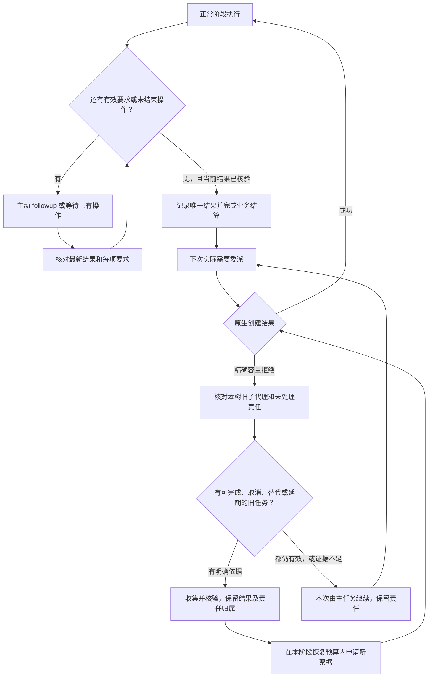
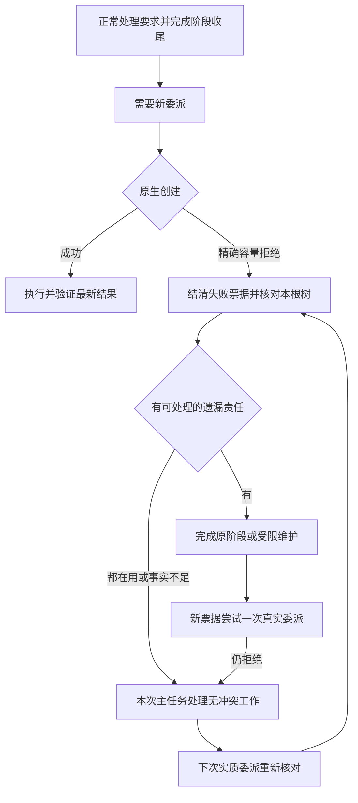

# 子代理驻留与主动收尾修复方案

版本：v3.1 已接受并实施，2026-09-09 更新。`0.4.0+codex.20260909030332` 已在 Mac 实装并通过本方案 P0—P4 验收，数据库 v10。独立复核与原任务验收发现的代码模式覆盖、迟到轮询、维护责任覆盖、拒绝消息及记忆引用摘要问题均已修复并复验。`004322`、`024100` 的通过和失败继续保留为历史证据。完整结果见文末及[Mac 验收证据](evidence/macos-residency-v3-live-20260909.zh-CN.md)。

**修复采用现有 Codex 原生工具：程序在正常流程中安排并验证子任务和消息收尾，宿主继续负责已有的按需缓存回收。满额时补做遗漏收尾，本次无法恢复就临时由主任务继续，下次需要委派时重新评估。宿主新增接口、提高名额和重开任务均不作为前置条件。**

## 1. 本次更正与目标

v2 方案把需求扩大了，由此得出了不成立的实施前提。更正如下：

| v2 额外要求或判断 | v3 更正 |
| --- | --- |
| 每个阶段完成后立即取得物理卸载回执，驻留数必须归零 | 及时处理业务与消息；允许已结束代理作为有界缓存驻留，由原生在需要名额时卸载。验收连续委派与无遗漏义务，不验收缓存立即为零。 |
| 插件必须取得原生 mailbox 的原子封闭、全局消息水位与释放事务 | 插件管自己的阶段、受管理消息和结算竞争；原生继续管队列和缓存，不由插件直接删除消息或销毁代理对象。 |
| 插件另起的 App Server 必须取得 Desktop 代理内存对象 | 由本根任务调用直接原生 followup/list/wait/interrupt，在拥有代理树的控制路径内执行。插件负责记录、约束与推进下一步。 |
| 关闭 Router、Hooks 后，QueueOnly 不自行消费，所以插件修复需要宿主改造 | 该实验只证明 QueueOnly 语义。相同实验中的 followup 已能恢复新建；关闭修复机制的对照不能否定该修复机制。 |
| 必须建设根任务停止采样后仍工作的独立执行器 | 活跃任务在阶段和回合结束前主动收尾；异常中断保留责任，在原任务恢复时继续。用户已明确，弃用任务对其它根树的容量不是本次重点。 |

用户要求保留：同一任务长期连续委派；模型和思考档位遵循路由；有效补充要求落实；完成、取消、替代、延期都有处理；未知状态先核实；满额回收只作保底；必须独立完成的审查实际发生。不能用永久主任务执行、提高名额、丢消息或要求用户不断“继续”作为修复。

这里的“主动”由插件流程和主任务执行共同实现：插件持久记录未完成责任、在正确入口返回具体动作并检查结果；主任务调用当前原生工具完成动作。正常路径不能仅增加一句可被遗漏的 Skill 提醒。插件没有独立业务执行进程，因此不得承诺主任务停止后会继续后台工作。

本方案不自动判断用户弃用了哪个任务，不扫描或清理无关代理树。原生名额、Router 的共享未结算预算、磁盘占用分别管理。

图中的业务结算不要求物理缓存立即为零；容量恢复也不删除未知消息。共享存储预算或 Hook 生效问题有各自的错误原因，不进入“原生名额满”的处理分支。

### 1.1 本次复核新增的问题与建议边界

v3 仍有一项附加保证过强：把维护期禁止所有工具副作用当成普遍可强制执行的能力。当前 Codex 原生 `write_stdin` 明确不触发 PreToolUse；不能声称把匹配器扩大为 `.*` 就获得了完整工具沙箱，也不能由此倒推必须修改宿主。用户已接受以下边界：**保证要求有处置、操作有终态核验、未知不会被算作完成；已有 Hook 能覆盖的调用继续实际拦截，不能覆盖的部分不冒充强制隔离。** 这是对方案附加保证的纠正，原先连续委派、补充落实、取消/延期处理和结果质量的目标不减少。

另有一个已真实复现的插件实现缺陷：上一候选 `183527` 的子代理运行同一个 `exec_command` 后，只是在代码块末尾多调用一次 `text()`，解析器就不再识别内部进程。对照中操作系统确认专属测试进程仍存活、释放条件尚未满足，但 Router 返回 `stageClosure=ready`、`pendingOperations=[]`。该对照使用当时受信 Hook 和真实模型，原生调用、身份和进程清理均留证；不是合成的 Hook 或推测。见[完整证据](evidence/macos-residency-v3-live-20260909.zh-CN.md)。因此上一候选的 7 组预设模型用例通过仍不足以放行。

修补建议使用已有原生执行回调，不扩建宿主：

1. 在已有 Bash PreToolUse 登记本 child 的执行调用和当前阶段；在已有 Bash PostToolUse 关联真实终态。当前原生源码在进程仍运行时不发该 Post；后续 `write_stdin` 观察到终止时仍使用原调用的 ID 发送 Post。当前分页原生日志还保存 `CommandExecution` 的独立结束事件；本次测试进程释放后已实际读取到该事件，可用于核对自然结束，不能要求已经退出的进程必须再被成功轮询一次。插件应利用这些已有路径，避免依赖模型怎样排版或打印 JavaScript。
2. 将该执行记录并入阶段收尾判据。追加输出、多个工具、并发、代码单元已返回等情况均不能把正在运行的命令从账本中抹掉。只登记未结事实与必要关联，不保留不必要的命令正文。
3. 缺失、重复、乱序、执行前被拒绝、非零退出、宿主中断和历史记录没有新回调的情况分别处理。原生源码只在工具处理成功返回时派发 Post，命令非零退出仍可能属于正常返回结果；工具层创建失败或前置拒绝须另行覆盖。因此不能把“每个 Pre 必须等到 Post”作为唯一解除条件。没有终态或经验证的未启动证据就保留待核实责任；按第 5.1 节设计异常核实，补齐正常错误路径，不能把新的未知项变成永久卡锁。此前 `EPERM` 对照实际是 Node 进程启动后写文件失败并退出 1，不能误记为“进程未启动”的证明。
4. 维护意图阻止新的业务授权；已运行操作由实际有权限的原任务完成、取消或接收结果。`interrupt`、子代理 final、外层 Script completed 都不能替代操作终态。对原生不提供 PreToolUse 的输入路径，不作无法实现的“全部硬拦截”承诺。
5. 在原任务升级前缓存、新缓存及普通多工具代码模式上实测；同一候选重新执行必要的完整检查。重新启用插件后原任务已收到实际回调，Erdos/Ptolemy 的旧缓存守卫已在中间候选验证；最终候选继续逐项复验，不新增宿主接口。

自动回调、准确命令和补丁终态、异常核实入口、到 v10 的保留迁移及旧写入防护已实现。真实创建失败经过未决责任、根核实、唯一结果和下一次委派的完整路径已通过。各版本测试与最终验收状态按下文记录，不以历史通过替代新候选。

### 1.2 独立复核和原任务复验补齐的边界

1. 旧代码模式既没有命令账本也没有原生开始事件时，外层完成不能证明内部工作结束。新覆盖标记仅来自实际受信 Start 后的日志前缀；历史采用不补写覆盖。旧未明项走原操作及实际根核实入口，不猜句柄、不直接删除。
2. 迟到轮询按原调用、child、turn 和已有句柄关联。旧命令终止不能清除复用句柄的新命令；终止后迟到的 running 不能重开旧工作。并发候选仍不唯一时保持未明。
3. `read_operations` 严格只读；采用历史身份由显式 `reconcile_messages` 完成。二次维护必须保留已核验的 transferred/deferred 责任，改变责任必须显式 `resolve_requirements`。维护活动时先拒绝冲突准入，不能被“尚未发生容量拒绝”的早返回绕过。
4. 精确的原生 Pre 拒绝记为 rejected，未送达要求仍由发送者负责；未知错误继续核实。v10 迁移保留原消息、键、索引与关联，不能把被拒绝消息冒充已消费。
5. 真实独立审查暴露了引用分离问题：raw final 含记忆引用尾块，native AgentMessage、task_complete 和 Stop 使用正文及单独引用元数据。程序只在 child、turn、非空 message id、正文内容块、完整引用元数据和完成文本全部相符时建立替代 Stop 摘要；完整 raw result 摘要仍进入验证令牌。错误身份、隐藏内容、引用后业务文字、冲突回执或缺少佐证均不能放行。不得要求模型删引用、重复 final 或伪造 Stop。

这些修补均使用现有原生记录和插件账务，未增加宿主接口。额外复核的负对照、原始日志回放与实际旧任务闭合分别留证。

### 已接受的资源策略

原生每根树三个名额，与插件现有的全局预算不是同一个限制。9 月 9 日原任务重验时，插件累计日志计量为 264,724,480 字节，另有三条其它任务未结预留；按每条 256 MiB 加上新委派的一份预留，总计超过插件 1 GiB 硬预算，因此返回 `ROUTER_CHILD_STORAGE_LIMIT`。当时实际磁盘可用约 49 GiB；这次阻断不是原生满额，也不是磁盘不足。没有清除或改动其它任务的预留。

用户已接受实际磁盘余量保护，当前默认实现保留累计日志审计、每条 256 MiB 预留、全局最多四条未结预留，以及扣除全部预留后的 4 GiB 空闲底线；累计历史字节不再构成永久的 1 GiB 准入上限。没有提高原生每树三名额，也没有删除其它任务预留或历史日志。

回归覆盖累计日志已超过 1 GiB 但实际磁盘充足时正常准入、四条未结预留仍阻止第五条、低磁盘仍拒绝，以及整数精度和预留乘法溢出检查。这是明确接受的资源策略变更，不是为单次验收临时清统计。

## 2. 已确认的原因和新证据

事故及原始任务依据见[原因调查](/Users/niuzhenya/Documents/adaptive-model-router/docs/evidence/macos-host-mailbox-capacity-cause-20260908.zh-CN.md)。已读取的任务为：**优化邮箱注册流程**、**解释 service_tier 未知提示**、**取消展示 service_tier 未知提示**、**完成 Hosted 验收并上线生产**。历史状态不表示这些子代理现在仍占用名额。

| 已确认事实 | 解释 |
| --- | --- |
| 当前三子代理驻留名额按根任务树计算 | 并非所有任务合计三个，也不是一个根任务累计只能创建三个。 |
| 原生已有自动回收 | 名额不足时寻找终态、无活动回合、无待处理 mailbox 的候选并卸载。 |
| 事故中的三名代理显示完成，但各有延后的 QueueOnly 消息 | 消息发送发生在最终完成之前；只在发送前检查一次 running/completed 也会遇到收尾竞态。 |
| 串行创建六个成功；三个完成者分别积压消息后新建失败；followup 处理一个后新建成功 | 不改上限即可恢复；故障来自未完成的消息责任。 |
| 之前的两次成功烟测各只创建两个子代理 | 未覆盖三份积压同时阻塞，不能代表完整恢复。 |
| 精确拒绝补丁仍有永久 `HOST_AGENT_LIMIT_REACHED` | 失败票据的预留可以结清，但同任务后续一直 root-only；这是本次必须消除的功能缺口。 |

本次新增的[编排对照证据](/Users/niuzhenya/Documents/adaptive-model-router/docs/evidence/macos-residency-plan-reassessment-20260908.json)：在当前 `codex-cli 0.153.4`、总容量四个（根加三个子代理）上，连续完成 **12 个阶段**。六次在初次完成后发送 QueueOnly，再由根调用 followup；另六次直接 followup 补充要求。十二条要求都进入准确子代理的输入，原生列表返回对应要求的新最终结果后才开启下一阶段，**容量拒绝为 0**。共 24 次子响应、76 个原生调用。

这次对照使用回环合成模型响应，无 Router/Hook、无业务写入；它证明现有工具的投递、续轮和容量路径，不证明真实模型语义质量或安装成功。原事故的收尾竞态仍须在开启 Hook 的验收中注入，不能把“完成后发送”的稳定复现当作原时序重放。探针协议测试当前 11 项通过。

原生源码依据固定为 `rust-v0.153.4` 的 `3d2ee51ca2d5db578f328aa75e20aa22c0197c9a`：[按需回收](https://github.com/openai/codex/blob/3d2ee51ca2d5db578f328aa75e20aa22c0197c9a/codex-rs/core/src/agent/control/residency.rs#L80)、[回收条件](https://github.com/openai/codex/blob/3d2ee51ca2d5db578f328aa75e20aa22c0197c9a/codex-rs/core/src/agent/control/residency.rs#L233)、[现有消息工具](https://github.com/openai/codex/blob/3d2ee51ca2d5db578f328aa75e20aa22c0197c9a/codex-rs/core/src/tools/handlers/multi_agents_v2/message_tool.rs#L68)。这不是要求重建或修改宿主。

## 3. 职责与最小状态模型

把业务结束和缓存驻留分开。每个阶段保留四类记录，复用现有数据库与 Hook，不新增通用宿主生命周期 RPC 或常驻 daemon。

| 记录 | 内容与用途 |
| --- | --- |
| 阶段 | root/context、routeId、stageId、准确 child 关联、意图版本、有效/完成/取消/替代/延期/待核实，说明现在允许做什么 |
| 要求与操作 | 必须处理的要求及版本、发送者和接收者、原生 tool call 关联、发送待确认/待处理/待验证/已处置，说明还有谁欠什么结果 |
| 执行与结果 | 当前子回合身份、已接收的最后结果、Stop 事实、根验证、工具或外部操作的未决责任、transcript 累计测量，防止旧结果结算新工作 |
| 待恢复事项 | 身份或记录缺口、遗留消息收集、当前容量暂忙、待委派阶段和下一触发入口，防止只保存永久错误标签 |

消息 ID、意图版本和操作 ID 是插件的业务关联，不能称为宿主 mailbox 序列或原生消费回执。Pre/Post Hook 使用实际可见的身份、目标和调用 ID；不修改或解密宿主加密消息。子结果声明处理哪些要求，根通过结果、代码、测试或操作回执验证。

保留可解析的私有 child locator；现有 `agent_id` 哈希不能反向当作控制目标。关联从受信启动元数据建立。未完成责任的身份和结果不随最近 64 条历史裁剪而消失。结果保存位置、读取失败和缺页须可检查，不以一句“已记住”代替。

资源状态只展示实际知道的事实，例如“原生列表显示驻留”“业务已收尾，物理驻留未单独查询”“原生创建成功”。不根据本地结算、列表缺失或计时推算已经释放几个物理名额。

## 4. 正常路径：及时处理而不等满额

### 4.1 发送与续轮

1. 必须由子代理处理的补充要求，默认使用现有 `followup_task`，无论发送瞬间代理是运行还是完成；它能启动闲置代理的下一轮。纯感谢、确认收到等没有工作含义的消息不发进子代理队列。
2. 保留 `send_message` 的必要用途；若目标为受管理 child，程序登记对应处理责任，不能以 QueueOnly 发送成功结案。发送者不能把“无需回复”当成“宿主不会留消息”的保证。
3. PreToolUse 在允许受管理发送/续轮前更新阶段版本并登记在途操作，使旧 Stop/旧验证立即失效；PostToolUse 记录实际受理或失败。没有 Post 时保留待确认，先查原调用，不能盲目重发。
4. 同阶段可有多次必要 followup，但只保留一个最终 outcome；不为清邮箱把已经结束的代理用于新业务阶段。影响结果的要求须全部落实或按明确意图处置。
5. 根验证最新结果后结算；在下一实质阶段路由和根正常结束前，插件检查是否仍有未处理要求、在途发送、缺失结果或未决操作。存在时返回准确下一动作，而不是静默 allow。

插件的结算与受管理发送在同一业务状态事务上竞争：发送登记先发生，旧版本不能结算；结算先发生，向旧阶段的新业务消息被明确拒绝并交回发送者，转给当前阶段。拒绝不能伪装投递成功。已被宿主受理但归属存疑的旧消息进入遗留对账。

这保证受管理流程的责任不丢；不宣称获得了整个原生 mailbox 的原子封闭。来自同树其它合法发送者的目标调用也需按准确 child 关联观察；无法归属的调用进入未知责任，不凭扫描不到正文就认定不存在。外部绕过插件的控制不由 SQLite 锁保护，也不据此执行强制删除或卸载。

### 4.2 最新回合的关联

修复前的实现中，`stop_observed` 只是布尔值，followup 不会使它失效，`observeSubagentStop` 也未接收 `turn_id`。因此第一次 Stop 后发生第二回合时，旧 Stop 仍可能满足结算条件；当前候选已增加续轮失效与原生回合关联，这项历史原因不能描述成仍未实施。

新实现保存每次受理操作及其后续回合/结果关联。每次续轮使旧终态失效；重复或延迟到达的旧 Stop 不得覆盖新回合。最终完成至少同时匹配当前要求版本、新最终结果、对应子回合的 Stop 和已结束状态。发送成功、模型开始采样或等待工具唤醒都不能单独证明完成。

不能依赖每次 followup 重新触发 SubagentStart 或 UserPromptSubmit：已驻留代理续轮通常没有新的 Startup，InterAgentCommunication 路径跳过 UserPromptSubmit。[启动 Hook 路径](https://github.com/openai/codex/blob/3d2ee51ca2d5db578f328aa75e20aa22c0197c9a/codex-rs/core/src/hook_runtime.rs#L124)、[带 turn_id 的 Stop](https://github.com/openai/codex/blob/3d2ee51ca2d5db578f328aa75e20aa22c0197c9a/codex-rs/core/src/hook_runtime.rs#L432)、[代理间输入](https://github.com/openai/codex/blob/3d2ee51ca2d5db578f328aa75e20aa22c0197c9a/codex-rs/core/src/hook_runtime.rs#L693)

关联从现有真实事件和输入记录建立；如果受理发生在当前回合内，不能机械要求必须多一个回合。对乱序先保存事实，等结果和输入关联汇合。时间戳先后、加一的本地计数不能单独当作宿主回合证明。

### 4.3 程序如何推进

Hook 负责登记、检查和提供下一动作，不在短生命周期命令里等待模型。根在正常流程处理结果；根 Stop 作为最后检查，阻止把可执行且影响交付的收尾遗漏成完成。不得依靠 Stop 无限重入循环：相同事实下只提示一次明确动作，重入仍未完成则保存具体责任，不能伪造 outcome 或清 gate。

下一次真实用户输入、原任务恢复或实质委派入口读取持久待办并继续，纯只读 status/history 不触发写入或执行。健康路径无需定时全量扫描。

## 5. 可靠的业务收尾标准

以下条件用于结清阶段和 Router 预留；满足后让原生按需回收缓存，**不主动销毁原生对象，不把这些条件表述为物理释放证明**。

| 编号 | 必须成立 | 不能替代它的现象 |
| --- | --- | --- |
| C1 身份明确 | 操作、结果与 child 均属于本根树的准确阶段 | 昵称相同、最近完成、列表里只剩一个 |
| C2 意图明确 | 当前目标已验收完成，或有明确取消/替代/延期记录 | 长时间没用、新开任务、猜测已经不用 |
| C3 要求有处置 | 每项已知有效要求经结果验证；失效有变更依据；延期/转交有完整待办和接收责任 | send/followup 返回成功、一句“已处理”、用摘要覆盖唯一原文 |
| C4 最后执行已结束 | 当前版本结果与相应回合结束事实匹配，无未决续轮或已知未结束的冲突操作 | 旧 completed、旧 Stop、interrupt 请求已发出、超时 |
| C5 结果可恢复 | 结果、验证、部分进度、待办和操作回执均有可读取的记录 | 只在短期模型上下文或临时服务内 |
| C6 结算版本一致 | 结算事务仍对应当前意图与要求版本，没有在途受管理发送 | 先查完、发送了新要求、仍用旧检查结算 |

未知情况先做有限核实。若只是缺少物理卸载回执，不影响业务结算；若缺少消息归属、执行结果或取消依据，不能把未知改成完成。信息缺口只阻止依赖该事实的动作，不阻塞其它无冲突工作。

原生可能先淘汰一个无积压的已完成代理，再由根验收结果。插件仍保存结果与验证责任；列表消失不自动产生 passed/outcome。后续业务若需要新阶段，按正常路由创建新 child。

### 5.1 正常自动核验与异常核实标准（已接受）

正常路径不增加人工检查：插件按准确 child、原生调用 ID、当前阶段和要求版本登记实际操作，接到可关联的原生终态后推进结算。`PostToolUse` 表示命令已经结束，不自动表示业务成功；非零退出必须反映在结果验证中。当前分页日志的 `CommandExecution` 结束项须校验原生任务身份、调用 ID、来源与终态字段，不能从 Shell 输出中搜索同名 JSON 冒充。旧格式日志不能假定存在该事件。

异常核实仅在真实证据缺失或冲突时触发，由当前主任务执行一次有界调查；不用高频扫描，也不要求用户逐个判断子代理。执行标准如下：

| 情况 | 允许解除当前执行责任的依据 | 不足时怎么办 |
| --- | --- | --- |
| 命令正常或非零退出 | 匹配原调用的真实 Post，或当前日志格式支持的独立命令终态；并验证当前工作结果 | 保留操作引用并继续获取实际结果，非零退出不能冒充通过 |
| 命令在创建前失败 | 主任务核对原始调用、错误所在的执行步骤及原生错误回执，能明确确认没有产生执行句柄；记录为何该错误证明未启动 | 错误可能发生在执行后、同一代码块含其它操作、或不能准确对应调用时，不能据此整批清空 |
| 已执行但返回丢失、中断或进程状态不明 | 通过原有句柄或该任务实际使用的工具核实结果/终止；外部写入同时核对服务实际状态，保留部分成果 | 不重发可能已发生的写入；转为有明确责任人的待核实项 |
| 旧 child 缺少新执行记账 | 收集原始要求、工具调用、结果、未完操作引用，主任务按相同标准逐项核对；不是把“旧版本”一律判为完成或一律永久锁定 | 缺失项明确保留，只阻止依赖它的动作 |
| 需求取消、被替代或延期 | 当前用户意图或任务记录支持该变更，每项遗留要求有处置及接收责任；运行操作仍按上面三行核实 | 不按年龄、缓存状态、空队列投影或子代理自述推断业务失效 |

现有 `manage_stage` 已增加异常核实明细，不新增宿主能力：操作 ID、当前版本、证据来源及摘要、核对结论、覆盖范围、未完成事项及责任人。根任务负责含义判断；程序负责检查关联、证据引用完整性、当前版本和未结项，不能把根填写的 `pendingOperations=[]` 当作证明。没有足够依据时不能填写“已停止”来获得名额。

开始记录、终态与核实明细需幂等合并；延迟旧事件不得覆盖新的执行。新的调用或要求使旧收尾令牌失效，outcome 事务内再核对快照。原始命令可能含敏感参数，业务账本只保存必要身份和摘要；查看原文使用已有受控日志，不复制无关内容。

这不是放弃未知状态，也不保证所有未知项都能立即自动解除。它把异常变成有处理者、有证据标准的具体任务，避免“没有通用机器证明，所以必须修改宿主”的错误前提。只有真实缺少用户意图或业务取舍时才向用户提问。

#### 5.1.1 代码复核后的具体缺口与实现约束

先前接口只有消息对账、维护和要求处置五种动作；closure pending 与 verify_maintenance 必须 ready 的相互约束导致异常入口不可达。现增加 `read_operations` 与 `reconcile_operations`，在 pending 时可逐操作核实，然后重新计算 closure。修补位于插件，不依赖新增宿主接口。

现有宿主还有正常完成但不产生 Bash Post 的路径：`exec_command` 识别到 `apply_patch` 后由内置补丁处理器执行，返回的 `hook_command`、进程句柄和退出码均为空；结果适配器因此不生成该 Post。源码固定为上述 `3d2ee51…`，见 [exec_command 的补丁拦截返回](https://github.com/openai/codex/blob/3d2ee51ca2d5db578f328aa75e20aa22c0197c9a/codex-rs/core/src/tools/handlers/unified_exec/exec_command.rs#L369)及[结果回调条件](https://github.com/openai/codex/blob/3d2ee51ca2d5db578f328aa75e20aa22c0197c9a/codex-rs/core/src/tools/context.rs#L405)。后续对照已在根任务实际执行一次专属临时补丁，并读取到准确原调用、回合和 FileChange 完成事件；核对内容后清理了临时文件。自动解析已利用这一现有事件补齐，本地回归通过；根任务对照加构造账本回放不等于完整真实 child 验收。它说明“未收到 Post”既不等于“仍有进程”，也不等于“没有发生写入”。

FileChange 终态必须同时匹配受管理 child、原生调用 ID、开始回合和已有命令记录；保留 completed、failed 或 declined 的实际结果摘要。重复事件幂等，不一致结果保留冲突，不生成不存在的退出码或 Bash Post。此类有准确原生终态的正常路径自动处理，不交给根人工解释；下面的核实入口针对仍然缺证或冲突的情况。

已实现的逐操作核实复用阶段日志和原生记录，不新增宿主协议。该动作在 closure pending 时可调用，但不直接设置 ready 或释放名额：

1. 根先读取具体操作 ID、准确 child、原生开始回合及当前操作快照。调用时同时提交阶段版本和操作快照摘要；仅检查阶段 revision 不够，因为命令回调可以独立于消息到达。
2. 每次仅处置明确列出的操作，提交原始调用/结果的可读取引用、核对结论和依据。结论分别为确定未启动、已完成、已停止、仍未明；不能用“已取消阶段”或一个空数组代替执行证据。
3. 根负责依据原始工具结果、实际成果和必要的操作状态判断含义；程序核对身份、引用完整性、当前版本、覆盖范围和未结项。普通非零退出、已发生的补丁写入必须保留其实际业务结果，不能伪装为未启动。模型在任意 `text()` 中打印的同名字段不是原生回执。
4. 在原有数据库事务中写入核实记录并使旧验证失效，然后重新计算 closure。还有消息、其它操作或待验证结果时仍 pending；原 outcome 保持唯一，历史已结算 outcome 不改写。
5. 相同核实重复提交幂等；新输入、不同命令、冲突结果或引用不可读必须重新核实。证据不足转为有来源、待办、责任人和恢复条件的未决项，不能为通过验收而清空。

用户已接受根承担异常含义判断。`operation-reconciliation.mjs` 按原生日志身份与行摘要核验引用；根核实结果须来自实际原生命令结果或严格单工具转发，不接受任意打印数据。操作快照覆盖消息、命令及真实调用/结果，忽略无关计量事件；失效证据重新保留为 pending。核实明细加密追加，旧 outcome 不改写；数据库 v9 保留冲突原貌，仅允许经过当前 closure 验证的记录结算。真实创建失败验收包含未明责任、根实际核实、伪造引用拒绝、重复幂等、没有伪造 Bash Post，以及同根新委派成功。

## 6. 完成、取消、替代、延期与遗留任务

| 情况 | 程序动作 |
| --- | --- |
| 原阶段仍有效且未结算，补充要求未完成 | 使用同阶段 followup，保存当前要求，等待新结果并重新验证 |
| 目标已经完成，只有无工作意义的旧消息 | 明确登记为无需业务执行；必要时用受限收集/收尾回合消费原生积压，不发送新寒暄制造循环 |
| 明确取消或替代 | 先登记新意图，禁止旧目标再准入新的业务工具；需要时 interrupt，核实当前操作的终止或结果，保存部分成果，处置旧要求 |
| 等待以后补充信息 | 保存具体缺失项、要求、成果和已发生操作；以延期收尾当前执行，恢复时重新核对意图和工作区 |
| 业务状态或消息含义不清楚 | 先收集要求与操作事实，不重新执行业务；可从本任务记录确定的由程序确定，确有会改变结果的用户决策才提出具体问题 |
| 身份或执行记录不完整 | 保留待核实项，通过准确原生关联补齐；不按年龄、列表缺失或“看起来空闲”清理 |

取消请求与执行停止分别记录。interrupt 返回只证明请求结果；仍运行的工具或外部操作须跟进其真实状态。主任务不能同时重做可能仍在执行的写入。这里使用当前任务本来就需要的工具/操作回执，不新增一套万能的宿主停止证明接口。

**旧 route 已经结算但仍有积压：** 保留旧 outcome，建立独立的维护记录，只允许收集遗留要求、保留进度、说明取消/移交和结束本次收尾。不能复活旧票据，也不能让旧 child 承担新的业务阶段。仍有效的业务交给当前根或按新票据创建的 child；明确取消的旧业务不重做。

旧 child 的受限维护是必须实现和实测的插件能力：通过准确目标的原生 followup 送入收集任务，由实际支持的工具 Hook 读取维护状态并执行拦截，同时核对执行账本和维护结果。完整的工具沙箱不作为回收前提，具体边界按第 1.1 节讨论；不能把无 PreToolUse 的原生路径也描述成已被强制拦截。维护最终回复必须覆盖本次收集要求，由根核对后结束维护。不能假定会再次触发 SubagentStart 来刷新授权；如需补充上下文，应使用现有可验证的 Hook 输出路径，并验收旧缓存与恢复后的两种情况。不得只靠一句“现在只读”或一个空操作列表便宣称已正确收尾。

维护过程中遇到确实无法从记录恢复的要求，保留原文/引用及明确缺口，不静默丢弃。没有明确取消依据，不能把有效要求作废；这时向用户讨论的是业务取舍，不是要求宿主开发接口。

## 7. 满额保底与恢复委派

1. 精确 `collab spawn failed: agent thread limit reached` 沿用当前原生审计。已匹配 dispatch 的失败尝试最多有一次 failed/tooling outcome；已有记录保留。未消费票据的参数拦截继续使用独立恢复规则，不混同。
2. 审计证明没有 child 后结清该次预留；历史拒绝保留为事故事实，当前容量只标记暂忙。删除永久 root-only 的行为，不删除审计。
3. 一次只检查本根树，优先处理身份清楚、有明确收尾动作的候选。默认最多核对本树当前三名额对应的候选，一次选择一个处理；需要真实模型完成的工作按原阶段跟进，不设置为了名额而杀任务的短超时。
4. 新收尾事实出现后，复核待委派工作仍被授权、未由根完成、无写入冲突，然后使用新票据尝试一次。**尝试新委派不等于预先声称物理名额已经释放；原生 spawn 是最终裁决者。**
5. 同一逻辑阶段在一次已审计容量拒绝后最多补做一次启动；再次拒绝就结束本次补救。不得同票据重试，不制造空任务探测，不提高额度。
6. 都在使用或仍不明确，本次由主任务完成可独立处理的工作；必须独立审查的阶段保留未完成，不能用自审替代。
7. 后续每个真实委派入口重新核对。若状态仍明确为全占用，则本次 continue；发现新收尾事实则准入。若当前观测无法判定但不存在已知执行/权限冲突，可按该阶段预算尝试一次真实需要的委派，接受原生拒绝；不要求先取得不存在的物理槽位证明。一次历史拒绝、相同时间戳或调用方 available 声明都不代表永久禁止或已经恢复。

本任务已有活动 Router 委派的 `busy` 语义保持不变：先完成或核实其责任，不能绕过 gate 增加重叠写入者。容量暂忙的待委派事项不签发 carrier、不占新预留、没有 outcome。必须区分“旧 child 仍有未完成责任”和“此新阶段暂未启动”。

## 8. 实现改动点

新增一个内部“阶段收尾”模块，集中维护事件、当前义务、结算检查和下一动作。继续复用现有 RouterStore、Hook、MCP 与原生工具；不新增对外宿主协议、消息清空服务或独立运行实例。表结构与迁移号按现有仓库约定确定。

| 位置 | 必要改动 |
| --- | --- |
| [delegation-gate.mjs](/Users/niuzhenya/Documents/adaptive-model-router/plugins/adaptive-model-router/scripts/lib/delegation-gate.mjs:215) | 分离子回合 Stop 与阶段结算；增加续轮/要求版本，结算核验 C1—C6；保留未完成责任的身份及结果 |
| [hooks.json](/Users/niuzhenya/Documents/adaptive-model-router/plugins/adaptive-model-router/hooks/hooks.json:31) 与 [hook.mjs](/Users/niuzhenya/Documents/adaptive-model-router/plugins/adaptive-model-router/scripts/hook.mjs:486) | 观察实际 send/followup/interrupt 及必要状态返回；准确识别目标归属；维护态约束 child 工具；传入真实 turn_id；保留密文不重写 |
| [database.mjs](/Users/niuzhenya/Documents/adaptive-model-router/plugins/adaptive-model-router/scripts/lib/database.mjs:1353) | 持久待办、发送/结算事务、根 Stop 检查；准确区分执行待核实和单纯缓存驻留 |
| [service.mjs](/Users/niuzhenya/Documents/adaptive-model-router/plugins/adaptive-model-router/scripts/lib/service.mjs) | outcome 前校验当前收尾事实；通过现有可兼容入口返回具体动作；status/history 保持只读 |
| [native-operation-evidence.mjs](/Users/niuzhenya/Documents/adaptive-model-router/plugins/adaptive-model-router/scripts/lib/native-operation-evidence.mjs) 与 [child-turn-evidence.mjs](/Users/niuzhenya/Documents/adaptive-model-router/plugins/adaptive-model-router/scripts/lib/child-turn-evidence.mjs) | 将真实执行记账与原生命令终态纳入收尾；覆盖普通多工具代码模式，补齐无 Post 的错误核实，不再依赖单一转发排版 |
| [router.mjs](/Users/niuzhenya/Documents/adaptive-model-router/plugins/adaptive-model-router/scripts/lib/router.mjs:221) | 将永久容量 continue 改为阶段级临时回退、下次重新核对和有限新票据准入；commit 时重验并发状态 |
| [delegation-recovery.mjs](/Users/niuzhenya/Documents/adaptive-model-router/plugins/adaptive-model-router/scripts/lib/delegation-recovery.mjs:205) | 保留精确无子审计、receipt 与幂等结算；历史拒绝和当前暂忙分开 |
| [host-capacity-recovery.test.mjs](/Users/niuzhenya/Documents/adaptive-model-router/plugins/adaptive-model-router/test/host-capacity-recovery.test.mjs) | 替换“永久禁止即通过”的预期，增加同根恢复与不会盲目重试的测试 |
| [Router Skill](/Users/niuzhenya/Documents/adaptive-model-router/plugins/adaptive-model-router/skills/adaptive-model-router/SKILL.md) 与 Hook 激活文本 | 同步同阶段续轮、主动收尾、受限维护及临时容量恢复；五个启动参数与根模型边界保持正确 |

初版优先通过现有 route/outcome 结果与 Hook 提供动作，避免老任务因冻结 MCP 工具清单而必须重开。若新增插件内部服务入口，安装验收必须证明旧任务可用的既有桥接路径能调用；不将新宿主 API 写成依赖。

维护操作使用持久 ID 和当前版本，重复事件幂等；原生调用不包在长 SQLite 事务中。发送回执缺失时先核对原调用，不能承诺未知副作用的“恰好一次”。followup 增长的 transcript 按已测高水位增量入账；业务结算不删除历史日志，缓存卸载不降低真实磁盘累计量。

## 9. 旧任务迁移与授权

- 保留原 route、唯一 outcome、容量拒绝 receipt 和可信事实；将旧永久容量标记迁为“历史拒绝，等待当前核对”，不批量清库，也不直接宣称所有名额可用。
- 旧 finalized child 与未结算 child 分开；前者使用维护记录，后者按仍有效的原阶段处理。未知身份先补齐，不按最近记录猜目标。
- 未 dispatch 的 route 没有 outcome；已启动但取消/延期的工作保留明确终止原因，未完整执行不伪装 passed，不由 Stop Hook 合成 unknown 来解锁。
- 同步升级 Hook/MCP/Skill 合同，旧进程写入采用迁移版本约束，避免新记录又被永久标记覆盖。重入迁移不能重复计量或丢待办；回滚保留新增责任，不能整库覆盖。
- 原 Hosted 任务恢复需要在该原任务的原生工具路径上验收。已完成业务不重做部署或数据库写入；使用仍被授权且真实需要的只读检查验证后续委派。
- 用户主动中断或长期不再进入原任务时，保留未完成责任，不自动取消或唤醒。重新进入时在本任务恢复，不能要求用户凭记忆重新交代所有子任务。

## 10. 测试和验收矩阵

保持现有三子名额，用能暴露当前实现缺陷的回归先建立失败用例，再实现。原生合成对照、插件单元/集成、开启 Hook 的真实模型验收分别报告，不互相冒充。

| 编号 | 场景 | 验收结果 |
| --- | --- | --- |
| V01 | 同根连续 100 个正常串行委派阶段 | 不调额、不重开；每个阶段完成收尾，无永久容量降级 |
| V02 | 要求到达运行中、最后响应生成中、初次完成后 | 均被正常处理；验证实际结果，不依赖发送前的一次状态检查 |
| V03 | 受管理发送与结算同时发生 | 新要求纳入当前版本或明确返回给发送者；无成功受理却无人负责 |
| V04 | followup 返回成功，但最终结果遗漏补充要求 | 根验证失败，不结算；补做同阶段工作，质量不能下降 |
| V05 | 三个已完成代理积压消息，真实容量拒绝 | 有界处理一个或必要候选后，同根用新票据恢复委派；旧失败仅结算一次 |
| V06 | 三个仍在用，或有不明执行 | 不强行回收；本次主任务仅做无冲突工作；下次委派重新检查 |
| V07 | 取消/替代与自然完成交错 | 不再授权新旧业务重复执行；已有副作用取得真实结果或终止回执，部分结果保留；不把取消意图当作万能的执行阻断 |
| V08 | interrupt 后工具尚未结束或操作结果不明 | 不把请求当终止，不重叠写入；跟进真实操作结果 |
| V09 | 延期后原任务跨轮恢复，需求或工作区变化 | 要求和进度可恢复，重新核对当前意图，不重复已完成操作 |
| V10 | Pre/Post/Stop/结果重复或乱序 | 当前子回合和要求正确关联；旧 Stop 不结算新续轮 |
| V11 | 同阶段多次 followup，含 LRU 后重新加载 | 每次新要求落实，最终 outcome 唯一，追加字节不漏记或重复 |
| V12 | 旧 route 已结算、child 仍有历史消息 | 受限维护可用，原业务不重做，旧 outcome 不变，当前工作恢复 |
| V13 | 发送已受理但本地未保存结果，或 Hook 中断 | 先核对原调用，保留明确待办，不盲目重发、不伪造完成 |
| V14 | 主任务被中断，后续在原任务继续 | 自动载入未完责任并推进；不声称中断期间有未存在的后台执行 |
| V15 | 旧 root-only 标记迁移、重复迁移及回滚 | 保留审计与工作，恢复下一次准入，未知记录不被清除 |
| V16 | 维护中的旧 child 尝试受 Hook 覆盖的 shell/写文件/新委派调用 | 核对确切命令和实际原生拒绝；只保留批准的收集与收尾授权，不外推为所有原生工具的沙箱保证 |
| V17 | 旧缓存 child 续轮没有新的 Start/Prompt Hook | 仍有准确授权、消息、Stop 和结果关联，不依赖假 Hook |
| V18 | 所需独立审查暂时无名额 | 保留待办，恢复后由实际子代理完成；自审不算替代 |
| V19 | 不同根树合法并行 | 原生三名额互不误清；共享 Router 预算仍正确 |
| V20 | 超过历史裁剪阈值、长日志、恢复记录缺页 | 未完成责任可定位；不靠删日志、无限增大扫描限制或只看尾部认定安全 |
| V21 | 新旧安装合同、冻结 MCP 清单及 Hook 信任 | 原任务可继续使用，启动五参数正确，不要求换任务 |
| V22 | 纯只读诊断、重复 outcome、预派发拒绝 | 不发生隐式执行，原票据安全及幂等规则不回退 |
| V23 | 普通代码模式、多次输出、多个或并发命令；外层完成但内部进程仍在运行 | 每个实际执行都有记录，操作未结束时不能 ready；真实终止后正常结算，不能限制业务代理只能使用特定排版的代码 |
| V24 | 执行回调缺失/乱序/重复、启动前拒绝、启动后 EPERM 等非零退出及 write_stdin 终态 | 使用原调用关联；同时验证“未结束不能放行”和“确实未启动/已结束不能永久卡住”；错误发生在哪一步必须区分，未知不等于零，不假设 write_stdin 有 PreToolUse |
| V25 | 代理已 final，命令稍后自然退出，未再次轮询；历史与当前日志格式不同 | 当前格式可凭准确独立命令终态继续收尾；无该事件的格式使用其实际可用回执与异常核实，不要求不存在的统一回调 |
| V26 | exec_command 被原生 apply_patch 路径接管，已有真实补丁结果但没有 Bash Post | 不等待不存在的命令回调；核对原调用、补丁结果及工作区成果后收尾，不误记为未启动、不重复写入；须经过真实 child 验收 |
| V27 | closure pending 时逐项核实异常；核实期间到达新消息、回调或冲突结果 | 核实入口可达；过期阶段/操作快照被拒绝；重复核实幂等；只影响已核实的操作，其它未决责任及唯一 outcome 不丢失 |
| V28 | 实际子代理 final 带记忆引用，native 与 raw 保存方式不同 | 相同 child/turn/message 的准确 Stop 正常闭合，完整结果和引用继续绑定；错误身份、内容形状、额外业务文本、缺失或冲突佐证不能放行 |

V01 允许固定模型响应，但必须经过候选 Router 和已启用、受信的 Hooks，实际执行 route → spawn → 必要续轮 → 最新结果验证 → 唯一 outcome → 下一次 route，核对模型/档位、未结算数量、历史裁剪与追加字节。无 Router/Hook 的长程探针仅算原生机制对照，不能计为 V01 或 P4 通过。V02/V04/V07/V09/V12/V16/V17 必须另有真实模型、启用 Hook 的用例核对结果质量与约束。至少覆盖要求在最后响应窗口到达的可控竞态、未结束工具和旧 child 的维护失败路径。

正常健康流程的验收要求是：未登记或无处理者的义务为零，所有已接受要求都有可核验处置；阶段交付前已完成必要收尾；长期可持续委派；没有重复业务副作用或重叠写入。已结束缓存可以保持驻留，物理驻留不要求立即归零。收尾耗时区分事件记账、模型执行和工具等待，不用强杀或丢信息换取三秒释放指标。

保留测试构建、root/child/route 关联、原生调用与回合、要求版本、新最终结果、验证、唯一 outcome、恢复后创建结果及进程清理证据。没有执行的检查明确标记未验收。

## 11. 实施顺序与发布

| 步骤 | 交付与退出条件 |
| --- | --- |
| P0 纠正设计与验证基础路径 | 当前已完成：原生 followup + 正常收尾的 12 阶段对照；不再以新增宿主接口为门禁 |
| P1 正常收尾与续轮记账 | C1—C6、受管理消息、当前回合关联、根结束检查、真实模型补充要求验收；先消除新孤儿来源 |
| P2 遗留维护与容量恢复 | 旧 child 的实际工具约束和消息处置、临时回退、下一次重新核对、新票据有限准入；复现三份积压并在同根恢复 |
| P3 迁移与兼容 | 旧标记、历史 outcome、字节记账、冻结清单、重复恢复、回滚通过；无关既有工作保持不变 |
| P4 Mac 安装与完整验收 | 候选全量相关检查、同根 100 阶段、Hook/真实模型质量、原任务恢复、独立审查及运行版本核对全部通过 |

P0 通过仅表示设计方向已有原生证据；不表示 P1—P4 完成。发现插件 Hook 关联或维护授权问题，应修插件实现并重跑具体用例，不能再次把未验证的插件设计变成“宿主必须新增接口”。只有获得新的实际证据与用户需求确实超出现有能力，才单独讨论该边界。

本次发布范围为 macOS；不宣称未测平台通过，不使用废弃的 windows-codex 项目。仓库另行存在的 v4 Phase 0、ADR、CONTEXT 和其它未提交修改不属于本方案，不借用其前提扩张本次工作。

安装核对候选源码、受管安装源、运行缓存及实际加载版本。现有 Hook 仍受信时不重复要求信任；若具体 Hook 变更触及真实信任边界，说明准确差异。整个验收由代理用原生工具完成。

最终实施结果：`0.4.0+codex.20260909030332` 已安装，核心摘要 `254116a354cec4ce1b0e1bf5dd9f334f86ee325d1415c5925d86c74ad3574ad5`。全量 450 项检查中 449 通过、0 失败、1 项 Windows 专属跳过；之后新增的回滚专项在兼容当前核心与实际旧 `024100` 实现上分别通过，未将专项混算进原全量计数。232 项策略检查零不匹配，4 项验收校验器与插件校验通过。旧 MCP 的 active/runtime/requested 匹配，数据库 v10 健康，七项 Hook 受信。

六项最终原生套件通过：同根 100 阶段（101 个唯一 outcome、711 次原生调用、零容量拒绝）、真实模型语义 8 项、真实命令 4 项、实际创建失败核实与后续委派、三个积压代理的实际满额恢复，以及同一 AppServer/共享 Router 数据库中双根的容量隔离与旧代理重载。双根各自保留三份补充责任、独立拒绝与恢复；重载后的两次 followup 各新增 65,536 字节，重复读验和相同验证不重复计量，另一根清单及预算不变。所有驱动拥有的进程组已退出。固定响应协议与真实模型质量分别归属。

原 Erdos 与原 Hosted 的 Ptolemy 精确 canary 均被实际守卫拒绝。Erdos 的 15 项历史未明操作按 34 条命令终态及两次拒绝逐项核实，原 outcome 不变；延期的修补责任在全部验收后通过 resolve_requirements 完成，revision 9。原 Hosted 在同一原根完成新资格与实际 gpt-6-astra / xhigh 审查，44 条旧 outcome 的同一摘要经本根只读重算确认不变，两项业务延期继续保留。本修复原根的代码审查与最终证据审查均由真实独立代理完成、验证当前结果后唯一结算。

V01—V28 的具体证据映射、原始报告与摘要见[Mac 验收证据](evidence/macos-residency-v3-live-20260909.zh-CN.md)及配套 JSON 的 finalReviewedCandidate。V09 区分合成延期要求的跨轮读取/明确取消与本原任务实际修补责任的跨轮恢复/完成；V15 验证的是兼容数据库 v10 的真实上一实现回退，不承诺任意不兼容旧版本可回滚。最终本原任务 pendingStageWork 为空、pendingOutcomes 为 0、stageClosure 为空、delegationGate 可用，P4 与本次完整 Mac 验收通过。Windows 原生验收和 Hosted 产品生产发布不在本次通过声明中；无需用户再启用或重复授权。
